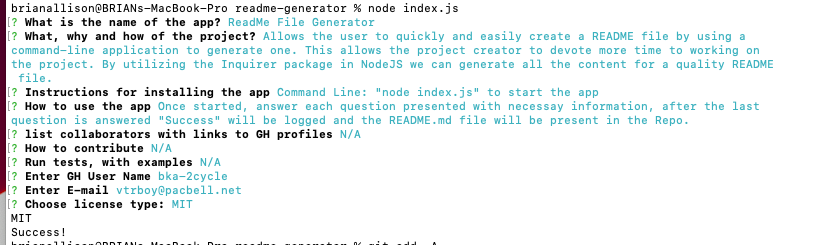

# ReadMe File Generator
  

  

  ## Description
  
  Allows the user to quickly and easily create a README file by using a command-line application to generate one. This allows the project creator to devote more time to working on the project. By utilizing the Inquirer package in NodeJS we can generate all the content for a quality README file.
  
  ## Table of Contents
  
- [Installation](#installation)
- [Usage](#usage)
- [Credits](#credits)
- [Contributing](#contributing)
- [Tests](#tests)
- [Questions](#questions)
- [License](#license)

  
  ## Installation
  
  Command Line: "node index.js" to start the app
  
  ## Usage
  
  Once started, answer each question presented with necessay information, after the last question is answered "Success" will be logged and the README.md file will be present in the Repo.
  
Image shows user inputs in blue.

  Watch Usage Video: 
  https://drive.google.com/file/d/10_lATE7efq_dnBaHxDHsHpw44I2aNKhf/view

  ## Credits
  
  N/A

  ## Contributing
  
  N/A
  
  ## Tests
  
  N/A
  
  ## Questions
  
  GitHub User Name: bka-2cycle, GitHub Profile: https://github.com/bka-2cycle

  Contact me with questions at: vtrboy@pacbell.net
  
  ## License
  
  MIT